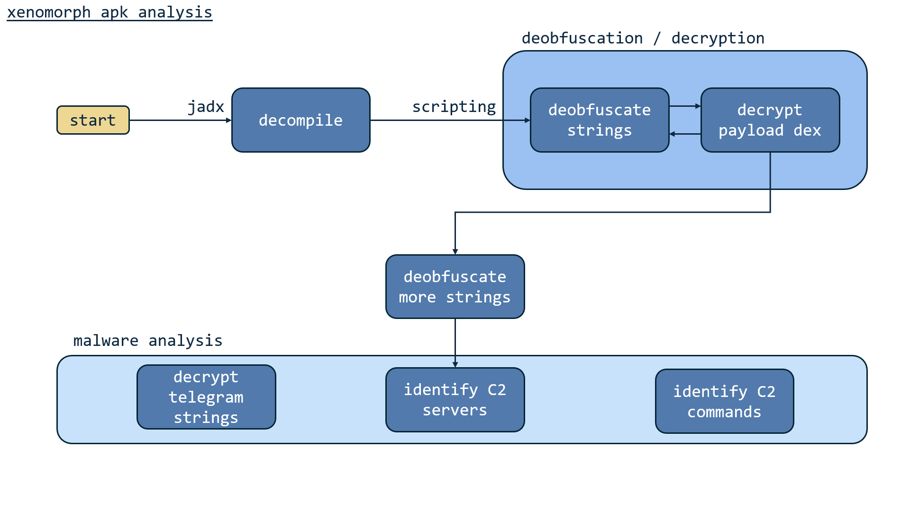
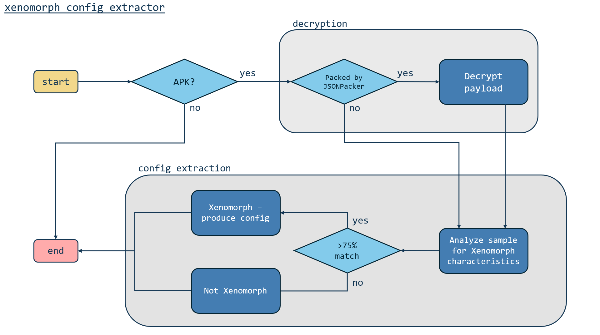

# Xenomorph-Config-Extractor

Decryption codes and static configuration extractor for Xenomorph APK malware.

## 🎄 Project Structure
```txt
.
├── article_scripts
│   ├── decode_cetdg_strings.py
│   ├── DecryptRumStrings.java
│   ├── DecryptTelegramC2.java
│   └── DecryptXenoDexPayload.java
├── config_extractor
│   ├── apk_extractor.py
│   ├── get_file_type.py
│   ├── main.py
│   ├── requirements.txt
│   ├── json_packed
│   │   ├── jsondecrypt.py
│   │   ├── json_deobfuscator.py
│   │   ├── json_unpacker.py
│   ├── xenomorph_config
│   │   ├── xeno_analyze.py
│   │   ├── xeno_decrypt.py
│   │   └── xenomorph.py
├── assets
│   ├── diag-xeno-analysis.png
│   ├── diag-xeno-config-extractor.png
├── example
│   ├── example-output.json
└── README.md
```

### 📜 About article_scripts
Decrypt strings and 2nd stage encrypted payload found in a highly obfuscated Xenomorph malware sample (SHA256: ```259e88f593a3df5cf14924eec084d904877953c4a78ed4a2bc9660a2eaabb20b```).

This sample was encrypted in a different manner from the other Xenomorph samples I analysed, thus requiring special scripts just for its deobfuscation and decryption.
<br>

These scripts are used in the deep dive analysis into this sample on Medium: [Deobfuscating, Decrypting and Detecting Xenomorph Malware](https://medium.com/csg-govtech/deobfuscating-decrypting-and-detecting-xenomorph-malware-5b1e63c59416).
<br>


### 📜 About config_extractor
Extracts Xenomorph malware configuration. 

The main.py script goes through a series of conditions to run various codes to determine whether the sample belongs to the Xenomorph malware family, and eventually extract the malware configuration.
<br>


Here's an example from a sample (SHA256: ```2877b27f1b6c7db466351618dda4f05d6a15e9a26028f3fc064fa144ec3a1850```).
You may also view the sample output.json file at [example-output.json](example/example-output.json).
```text
> python main.py ../../xenosamples/2877b27f1b6c7db466351618dda4f05d6a15e9a26028f3fc064fa144ec3a1850
   _  __ ____ _  __ ____   __  ___ ____   ___   ___   __ __  _____ ____   _  __ ____ ____ _____
  | |/_// __// |/ // __ \ /  |/  // __ \ / _ \ / _ \ / // / / ___// __ \ / |/ // __//  _// ___/
 _>  < / _/ /    // /_/ // /|_/ // /_/ // , _// ___// _  / / /__ / /_/ //    // _/ _/ / / (_ / 
/_/|_|/___//_/|_/ \____//_/  /_/ \____//_/|_|/_/   /_//_/  \___/ \____//_/|_//_/  /___/ \___/  

This script decompiles APK/DEX files, detects and unpacks files packed by JSON-Packer, and extracts Xenomorph configuration.

...

----------------------------------------------------------------------------------------------
Results saved to /home/kali/Desktop/xeno-zip/config_extractor/output.json

APK SHA256:         2877b27f1b6c7db466351618dda4f05d6a15e9a26028f3fc064fa144ec3a1850
Output dir:         /home/kali/Desktop/xeno-zip/config_extractor/2877b27f1b6c7db466351618dda4f05d6a15e9a26028f3fc064fa144ec3a1850

JsonPacker-packed:  True
Decryption key:     ['Ianj']
Decrypted APK dir:  /home/kali/Desktop/xeno-zip/config_extractor/2877b27f1b6c7db466351618dda4f05d6a15e9a26028f3fc064fa144ec3a1850/newapk
Obfuscated strings: True, ['hq.json', 'DynamicLib', 'DynamicOptDex']

Xenomorph family:   True
Domain names:       ['simpleyo5.tk', 'simpleyo5.cf', 'kart12sec.ga', 'kart12sec.gq']
Matched strings:    ['sms_log', 'notif_ic_disable', 'inj_list', 'notif_ic_enable', 'sms_ic_disable', 'inj_enable', 'app_list', 'sms_ic_enable', 'inj_update', 'inj_disable', 'sms_ic_update', 'sms_ic_list', 'notif_ic_list', 'self_cleanup', 'notif_ic_update', 'fg_disable', 'fg_enable', 'app_kill', 'metrics', 'ping', '5f9e4a92b1d8c8b98db9b7f8f8800d2e', 'com.android.packageinstaller:id/permission_allow_button', 'com.android.permissioncontroller:id/permission_allow_button', 'com.android.settings:id/action_button', 'com.android.settings:id/button1', 'android:id/button1', '4e7d36521f246327efffde4e5f3d1705bacff85a7d3cf1836d31714196434d79', 'f82847a89d3e776505ab6af6cf2d0298455b52f9e9741cd0d9d3714451a96aff', 'd83fa5b262824b544ed5565164a1791e29d015bdd325461ed9344a9a5b60c9b5', '34a6a777402003a51fa70f4184ec8340c4dda695849309bbf5647648b2c3c62d', 'android.permission.READ_SMS', 'android.permission.RECEIVE_SMS', 'android.permission.WAKE_LOCK', 'android.permission.RECEIVE_BOOT_COMPLETED', 'android.permission.ACCESS_NETWORK_STATE', 'android.permission.INTERNET', 'android.permission.READ_PHONE_STATE', 'android.permission.USE_FULL_SCREEN_INTENT', 'android.permission.FOREGROUND_SERVICE', 'android.permission.READ_PHONE_NUMBERS']
```

The code makes use of the Karton framework from CERT-Polska to pass Tasks from script to script.
- [GitHub - CERT-Polska/Karton](https://github.com/CERT-Polska/karton)
- [Karton documentation](https://karton-core.readthedocs.io/en/latest/index.html)

The code also makes use of the script by Cryptax to unpack JsonPacker-packed files.
- [GitHub - cryptax/misc-code/jsonpacker/jsondecrypt.py](https://github.com/cryptax/misc-code/blob/1dbc90c901a205d494a9b71093ecf5a4f18d716b/jsonpacker/jsondecrypt.py)
- [Unpacking a JsonPacker-packed sample | by @cryptax | Medium](https://cryptax.medium.com/unpacking-a-jsonpacker-packed-sample-4038e12119f5)

### 👾 Test samples
These are the Xenomorph samples which were available at the time of analysis and thus were tested on using the respective scripts.
<br>
Do note that they could also work on other Xenomorph samples with the same decryption method.
| Code from... | Description                                              | Test Samples SHA256   |
| ------------ | -------------------------------------------------------- | ----------------------- |
| article_scripts   | Decrypt strings and 2nd stage encrypted payload found in a highly obfuscated Xenomorph malware sample. | <ul><li>259e88f593a3df5cf14924eec084d904877953c4a78ed4a2bc9660a2eaabb20b</li></ul> | 
| config_extractor   | Extracts Xenomorph malware configuration. | <ul><li>2877b27f1b6c7db466351618dda4f05d6a15e9a26028f3fc064fa144ec3a1850</li><li>9ce2ad40f3998860ca1ab21d97ea7346bf9d26ff867fc69c4d005c477c67a899</li><li>6af8683c314fd060631e4789b7a793e73d209d87918f3112e8903a090940237d</li><li>dcb88fb46c8d030c6f92dff0cd5e4c2f5bdf223070f2596c86a454f1adf00729</li></ul> |

## 🔧 Usage
For reference, I used a virtual machine with Kali Linux 2024.2 release and the following versions:
- Python 3.12.6
- OpenJDK 23
- javac 21.0.5-ea

Install the following:
- python3
- jadx
- grep
- dexdump
- java
- javac

Install python packages:
```console
pip install -r /path/to/requirements.txt
```

### article_scripts
#### decode_cetdg_strings.py
> Decodes strings in class ecd.retbpse.slefdiurp.ffgh.cetdg from sample SHA256: ```259e88f593a3df5cf14924eec084d904877953c4a78ed4a2bc9660a2eaabb20b```. 
>
> Usage:
> ```console
> python decode_cetdg_strings.py
> ```
#### DecryptRumStrings.java
> Decrypts strings related to command "execute_rum" in 2nd stage dex payload from sample SHA256: ```259e88f593a3df5cf14924eec084d904877953c4a78ed4a2bc9660a2eaabb20b```.
>
> Usage: 
> ```console
> javac DecryptRumStrings.java
> java DecryptRumStrings
> ```
#### DecryptTelegramC2.java
> Decrypts encrypted C2 found in Telegram bio, in 2nd stage dex payload from sample SHA256: ```259e88f593a3df5cf14924eec084d904877953c4a78ed4a2bc9660a2eaabb20b```.
>
> Usage:
> ```console
> javac DecryptTelegramC2.java
> java DecryptTelegramC2
> ```
#### DecryptXenoDexPayload.java
> Decrypts encrypted dex payload in sample SHA256: ```259e88f593a3df5cf14924eec084d904877953c4a78ed4a2bc9660a2eaabb20b```.
> Encrypted dex payload found in resources/assets/sqvgk/lkfupve.gvo.
>
> Usage:
> ```console
> javac DecryptXenoDexPayload.java
> java DecryptXenoDexPayload <input file path> <output file path>
> ```
>
> The input file should be the encrypted dex file.
### config_extractor
#### main.py
> This script decompiles APK/DEX files, detects and unpacks files packed by JSON-Packer. It goes through a series of conditions to run various codes to determine whether the sample belongs to the Xenomorph malware family, and eventually extract the Xenomorph malware configuration.
>
> Usage: 
> ```console
> python main.py <file path>
> ```

## ✏️ Author

**cano32**
- :octocat: [GitHub](https://github.com/cano32)
 
## 📃 License
[](https://opensource.org/licenses/Apache-2.0)
